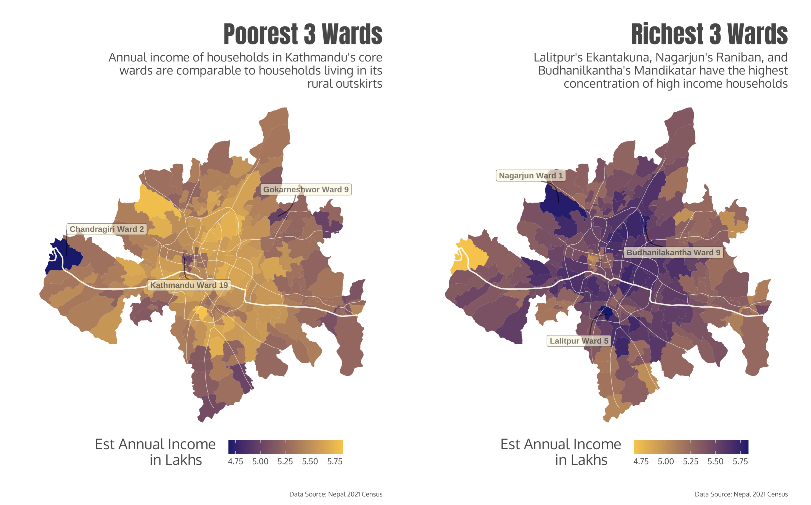

+++
date = '2025-01-31T20:04:02-05:00'
draft = false
title = 'About'
excludeFromIndex = true
+++

    

        <h1 class="greeting">Hi, I'm Avani 👋</h1>
    

    

        
    

    

    
I'm a technologist passionate about leveraging spatial data to address our most pressing challenges.
 
    
The individual person thinks in terms of space. Spatial data can help uncover unique insights on transit, consumer behaviour, public health, supply chains, and labour markets through a people-first lens.

    
This is my personal website where I document my own learnings about our world. I am very grateful to all that are taking their time to view my work—please feel free to direct any feedback, suggestions, or thoughts to my <a href="mailto:avaniadhikari@hotmail.com">email</a>.
    

    <h2 class="gallery-header">Featured Projects</h2>
    

        <a href="/posts/nepal_census/" class="gallery-item">
            
            

                <h3 class="gallery-title">Unpacking Nepal's Census</h3>
                
Using data cleaning methods, I converted tabular census data into spatial formats that can be easily mapped.

            

        </a>
        <a href="/posts/coal-plants/" class="gallery-item">
            
            

                <h3 class="gallery-title">Where are America's Coal Plants?</h3>
                
A short analysis of the coal industry in America.

            

        </a>
        <a href="/posts/spotspotter-a-parking-finder/" class="gallery-item">
            
            

                <h3 class="gallery-title">Spotspotter</h3>
                
Spotspotter is my first mobile application that seeks to crowdsource information on parking availability.

            

        </a>
        <a href="/philly-crash" class="gallery-item">
            
            

                <h3 class="gallery-title">Finding Safe Strees in Philly</h3>
                
Analysis of traffic accident patterns and safety metrics across Philadelphia.

            

        </a>
    

    <h2 class="facts-header">Some quick facts about me:</h2>

<ul>
  <li data-emoji="🌏">
    I had a very international childhood, an experience that instilled in me a love for seeing and learning about the world. So far, I've lived in 6 countries and counting!
  </li>
  <li data-emoji="📈🌇">
    I am an Urban Economist by training. I have a Bachelor's in Economics from Yale-NUS College and a Master's in Urban Planning from the University of Pennsylvania.
  </li>
  <li data-emoji="👩‍💻">
    My projects are a way for me to improve my own technical skills. My work is done in the following languages:
    <ul>
      <li class="tech">Data Analysis: Python, R, SQL</li>
      <li class="tech">Software Development: HTML, CSS, Javascript </li>
    </ul>
  </li>
</ul>

