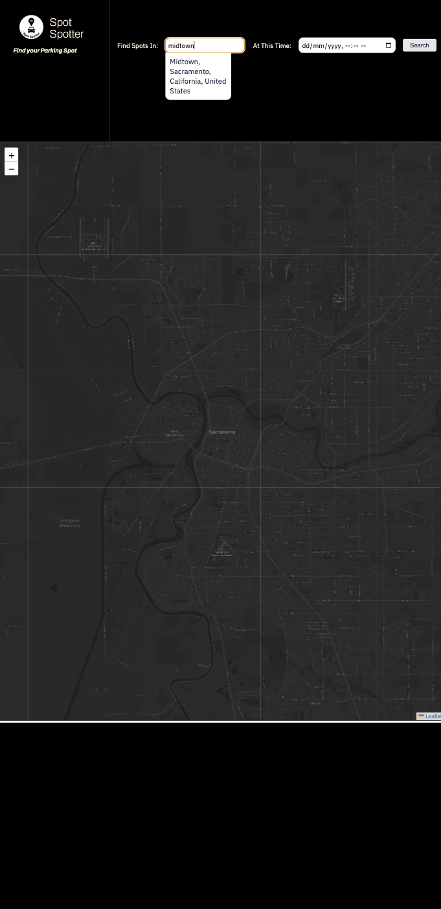
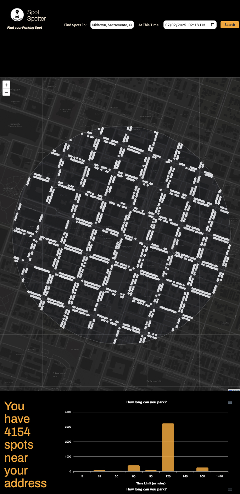
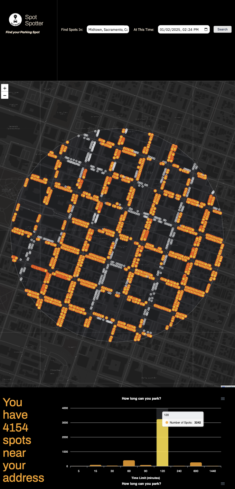
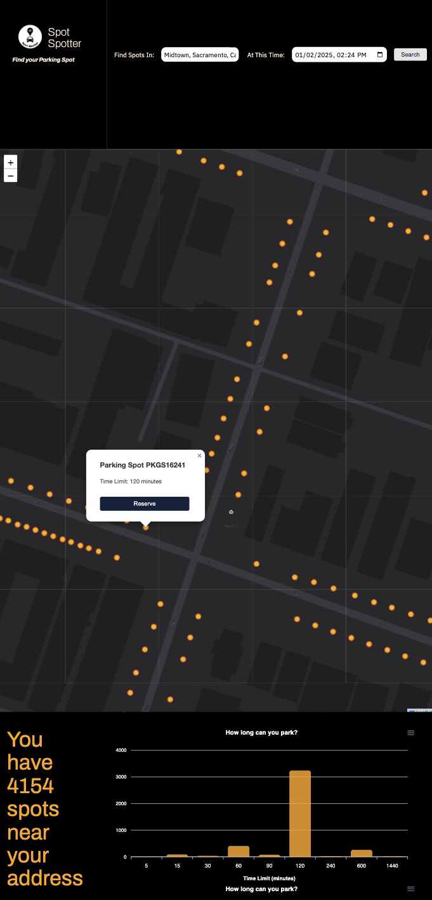
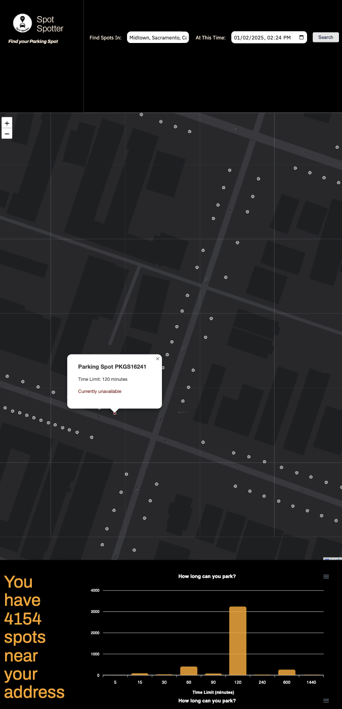

+++
date = '2025-01-31T19:52:04-05:00'
draft = false
title = 'Spotspotter: A Parking Finder'
+++

**Tools**: HTML, CSS, Vanilla Javascript (with modules like leaflet and chart.js)

As you circle around the block for the 5th time searching for an empty parking spot, don't you think—wow, I wish there could be an easier option?

**Spotspotter** is an interactive, crowdsourced parking finder that seeks to solve this information gap in Sacramento. 

  

    
    
 Enter a location and a time slot to see all the available parking within walking distance.

  

  

    
    
The page also deploys an interactive chart showing the number of spots and their maximum parking time.

  

  

    
    
You can click around the chart to see all the spots of a given time slot highlighted. 

  

  

    
    
Find a spot you like? Users can zoom into the particular spot and reserve it for the time limit.

  

    

    
    
Reserved spots will then be unavailable to all users until the time slot runs out.

  

