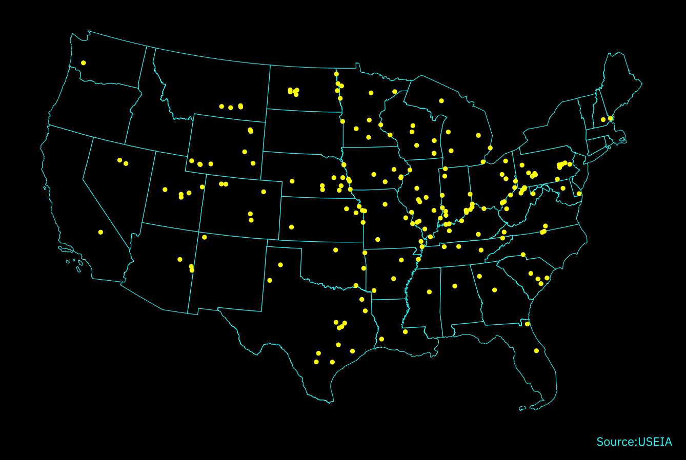

+++
date = '2025-01-31T19:52:04-05:00'
draft = true
title = 'The Coal Plants Still Powering America'
+++

As of 2025, there are still 200 power plants across the United States that are powered by coal. While these facilities fulfill the important purpose of balancing electrical loads, their negative impacts on both human health and the environment are well documented. The map below visualizes the location of active coal power plants across the United States, with a 10-mile radius marked around each facility to illustrate the areas most directly affected by their emissions.

While 200 coal power plants may seem like a relatively small number, these facilities pose significant health and sustainability concerns for approximately 66 million Americans who live in counties hosting these installations. Pennsylvania has the highest amount of people that live in counties hosting coal power plants followed by Missouri, Texas and Ohio.

