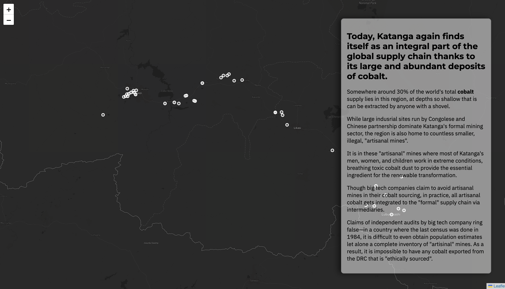
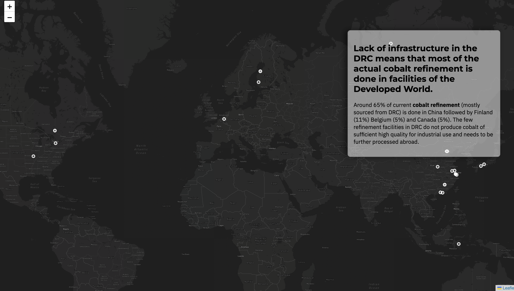

+++
date = '2025-02-07T14:03:58-05:00'
draft = false
title = 'The Cobalt Supply Chain'
+++

**Tools**: HTML, CSS, Vanilla Javascript (with modules like leaflet)

### For more than a century, the **Democratic Republic of Congo** has been **foundational** in the development of modern technologies. 

**Rubber** for car tires, **copper** for electrical wiring, and even the **uranium** used in the Manhattan Project—all of them came from the mines of the **Democratic Republic of Congo**. Yet, very little of material benefit from these resources has ever trickled down to its people. 

Today, the DRC is the supplier of another key natural resource—**cobalt**, which is essential in all **battery-powered electronics**. **70% of cobalt** used in all global **Electric Vehicles**, **Smartphones**, **Laptops**, and more come from the DRC, mined by men, women, and children in extremely hazardous conditions[1](https://www.cfr.org/blog/why-cobalt-mining-drc-needs-urgent-attention). 

View my full storymap following the supply chain of Cobalt from the DRC [here](https://avavani.github.io/cobalt_storymap/drccobalt/index.html). 

