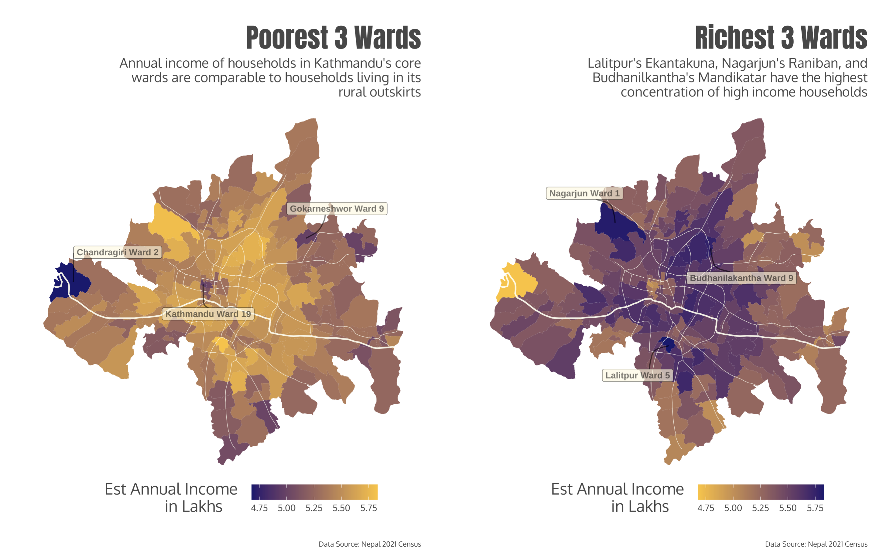
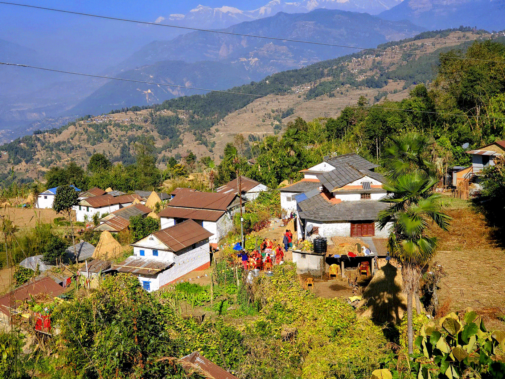

+++
date = '2025-02-04T14:03:58-05:00'
draft = false
title = 'Mapping Household Wealth in Kathmandu'
+++



**Tools**: Python, R

Statistically speaking, Nepal is a poor country. It ranks 180/222 in terms of GDP per capita [1](https://www.cia.gov/the-world-factbook/field/real-gdp-per-capita/country-comparison/), ranking well behind other post-conflict nations of Kosovo(132) and Laos (153). 23.8% of the adult population are illiterate and [2](https://censusnepal.cbs.gov.np/results/literacy) and 41.9% of households sleep under roofs of galvanized tin sheets [3](https://censusnepal.cbs.gov.np/results/household).

Almost 42% of the Nation's populations lives in housing made out of galvanized steel. Source: 2021 Nepal Census

However, such reality seems extremely far away in the capital city of Kathmandu where Teslas frequent the roads. Kathmandu's prosperity isn't new and stems from a list of historic and geographic factors. Situated at 4.6K ft above sea level, the Kathmandu valley is a large swath of fertile flatland in the mountainous Himalayan Range[4](https://www.fao.org/4/t0706e/T0706E01.htm). Due to this geographic advantange, the region has been continously settled for at least 2000 years [5](https://www.nepalhikingteam.com/origin-of-kathmandu-valley). The large settlements attracted more people and soon Kathmandu found itself as an important trading hub, linking the India-Tibet land route [6](https://www.asiasocietymuseum.com/buddhist_trade/himalaya_nepal.html). Kings built roads, waterworks, and schools; merchants traded gold, spices and silk; while pilgrims spread art, region and philosophy. Consequentialy, Kathmandu and its residents grew rich while its surrounding countryside languished into subsistence farming.

We can see Kathmandu's regional dominance displayed clearly in its 2021 Census data[7](https://censusnepal.cbs.gov.np/results/downloads/ward?type=data). A comprehensive decinnial survey, the 2021 census is the most recent and most representative data on Nepal's socioeconomic factors. Key metrics such as number of households and their associated wealth quintile is present at the municipal ward level in excel format. While the data is not spatial, it is possible to use data cleaning methods to convert them. This report hence marks the first spatial exploration of the Nepal census data.

## Wrangling my Data

To begin my analysis, I first load the ward level shapefiles for Kathmandu valley into my environment. No public GIS data exists on political boundaries—however, in its absence, civillians have taken up charge on digitizing hence. All spatial files in this analysis is thanks to the hard work of Kiran Joshi, whose blog can be found [here](https://sites.google.com/view/maze215/home?authuser=0).

As there are no spatial geometries present in the census data, we need to join it to the ward level map by their corresponding wards. But, having been phonetically converted to English, the municipalities are not spelled the same way across the dataset. Additionally, the data also contains unnecesary (and unstandardized) descriptors which will inhibit a join.

To address these issues, I remove all unneeded suffixes and match my datasets using a fuzzy criteria. Two neighbourhoods are considered the same if their names are up to 80% similar.

```python
from fuzzywuzzy import fuzz
from fuzzywuzzy import process

#helper function to clean unnecesary descriptors
def clean_name(name):
    name = name.strip()
    suffs = [
        ' Municipality',
        ' Metropolitian City', 
        ' Metropolitan City',
        ' Mahanagarpalika',
        ' Nagarpalika',
        ' Nagarpalika VDC',
        ' Mun',
        ' Gabisa Karyalaya',
        ' Gabisa Bhawan',
        ' Gaunpalika',
        ' Sub Metro'
    ]
    clean = name
    for suffix in suffs:
        if clean.endswith(suffix):
            clean = clean[:-len(suffix)].strip()
    
    return clean

# Cleaning the column containing municipality information
cities['Municipality'] = cities['Mun_Name'].apply(clean_name)
valhhwealth['Municipality'] = valhhwealth['name'].apply(clean_name)

# fuzzy matching accoridng to cleaned names
def find_match(name, choices, min_score=80):
    best_match = process.extractOne(name, choices)
    if best_match and best_match[1] >= min_score:
        return best_match[0]
    return None

# creating a mapping column of fuzzy matched names
name_mapping = {}
for name in cities['Municipality'].unique():
    match = find_match(name, valhhwealth['Municipality'].unique())
    if match:
        name_mapping[name] = match

#adding those to the dataset
cities['new_name'] = cities['Municipality'].map(name_mapping)

# joining my census data to the spatial files
cities_inc = pd.merge(cities, 
                     valhhwealth,
                     left_on=['new_name', 'Ward_No'],
                     right_on=['Municipality', 'ward'],
                     how='left')

#finally, converting my data to WGS84
cities_inc = cities_inc.to_crs('EPSG:4326')
```

## Setting the city limits

Our analysis will not be very useful if we include sparsely populated hill wards in our dataset. Our study area needs to have tigther city limits—for this purpose I use a road density based selection criteria. Using road network data from Open Street Maps, I calculate the density of streets by area for each ward. I then filter out all wards who fall in the bottom 30th percentile for road density.

```python
import osmnx as ox
from shapely.geometry import Polygon

#getting my valley shapefile
valley = cities_inc.dissolve().make_valid()
#getting streets within valley
street_network = 
    ox.graph_from_polygon(valley.geometry.iloc[0], network_type="drive")

#getting street edges
edges = ox.graph_to_gdfs(street_network, edges = True, 
    nodes = False).to_crs(cities_inc.crs)

#counting number of streets per ward
cities_inc['streetcount'] = cities_inc.geometry.apply(
    lambda x: len(edges[edges.intersects(x)])  
)

#creating density metric
cities_inc['streetdensity'] = 
    cities_inc['streetcount']/cities_inc['Area_SQKM']

#selecting 30th quartile threshold
threshold = cities_inc['streetdensity'].quantile(0.30)

#subsetting values
main_city = cities_inc[cities_inc['streetdensity'] >= threshold]
```
## Visualizing Wealth Patterns

The resulting dataset allows us the visualize the distribution of households by their economic quartile across Kathmandu. Toggle with the layer selection on the top right to see how the percentage of households belonging to each economic quartile varies across the city.

```python
import folium
m = main_city.explore(
    column='quart5_%',
    legend=True,
    cmap='viridis',
    name='Highest Income',
    tooltip=['name', 'ward', 'quart5_%', 
    'quart4_%', 'quart3_%', 'quart2_%','quart1_%']
)
main_city.explore(
    column='quart1_%',
    cmap='inferno',
    name='Lowest Income',
    m=m ,
    tooltip=['name', 'ward', 'quart5_%', 
    'quart4_%', 'quart3_%', 'quart2_%','quart1_%']
)

folium.LayerControl().add_to(m)

m
```
<iframe src="/atlas/html/nepal_census/map1.html" width="100%" height="800px" frameborder="0"></iframe>

### Estimating Income Distribution

Though the census data doesn't provide us with information on median household income, it is possible to estimate this data using other publicly available government data. The National Statistics Office has information on the median and mean income values for each quartile on their [website](https://data.nsonepal.gov.np/dataset/b6c3c19b-4b15-44bf-8653-1571e76dad14/resource/d711c2a1-2f5c-47a6-be02-bb4073fe234d?inner_span=True). 

I used this information to come up with weighted estimates of median income for each ward using the proportion of quantile distribution. 

```python
#getting the median income value for all economic quartiles
med_inc = {
    'quart1': 242797,  
    'quart2': 299341,  
    'quart3': 377000,
    'quart4': 465301,  
    'quart5': 617882  
}

#calculating its weighted estimate based on ward level population
main_city['Est Income'] = (
    main_city['quart1_count'] * med_inc['quart1'] +
    main_city['quart2_count'] * med_inc['quart2'] +
    main_city['quart3_count'] * med_inc['quart3'] +
    main_city['quart4_count'] * med_inc['quart4'] +
    main_city['quart5_count'] * med_inc['quart5']
) / main_city[['quart1_count', 'quart2_count', 'quart3_count', 
        'quart4_count', 'quart5_count']].sum(axis=1)

#rounding and cleaning the datatype
main_city['Est Income'] = 
    pd.to_numeric((main_city['Est Income'])/100000).round(1)
```
And this gives us our final dataset! Explore the income distribution yourself below to learn more!

<iframe src="/atlas/html/nepal_census/map2.html" width="100%" height="800px" frameborder="0"></iframe>